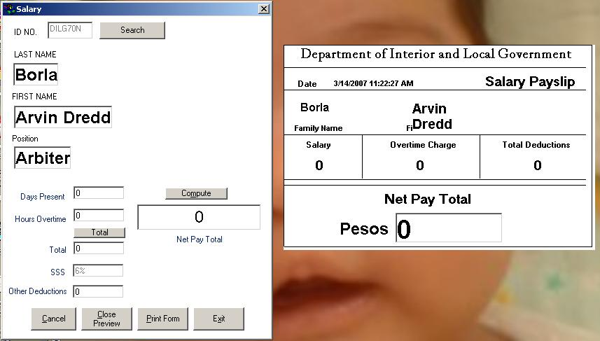



## Payroll System

### Description

This is a simple ADODC System for a Payroll
 
### More Info
 

             |
---                |---
**Submitted On**   |1999-04-23 22:22:00
**By**             |[Arvin Borla](https://github.com/Planet-Source-Code/PSCIndex/blob/master/ByAuthor/arvin-borla.md)
**Level**          |Advanced
**User Rating**    |4.8 (19 globes from 4 users)
**Compatibility**  |VB 6\.0
**Category**       |[Databases/ Data Access/ DAO/ ADO](https://github.com/Planet-Source-Code/PSCIndex/blob/master/ByCategory/databases-data-access-dao-ado__1-6.md)
**World**          |[Visual Basic](https://github.com/Planet-Source-Code/PSCIndex/blob/master/ByWorld/visual-basic.md)
**Archive File**   |[Payroll\_Sy2053663132007\.zip](https://github.com/Planet-Source-Code/arvin-borla-payroll-system__1-68134/archive/master.zip)

